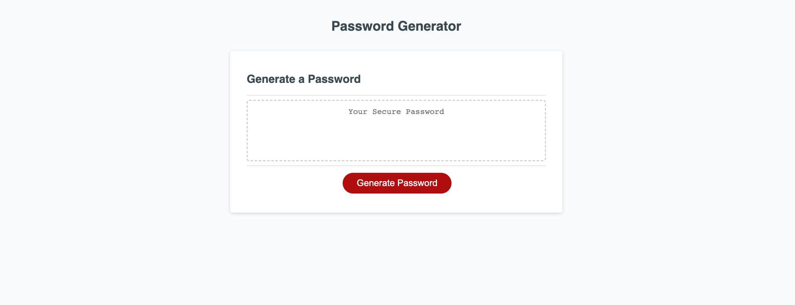

# Password-Generator-Challenge #

## Description ##
With the starter code provided I did not add or remove anything in html or css. I added JavaScript code to make the password generator meet the acceptance criteria. I used arrays, console.log, if statements, and ect. To use the password generator you click on the "Generate password" button. It will then ask you how many characters you would like between 8 and 128. If you dont select a number between 8-128, it will ask you to. If you select a valid number, next it will ask you if you would like uppercase/lowercase letters, numbers, or special characters. Once you input your password preferences it will generate a password for you. I also made comments on JavaScript describing the code's purpose/value. 

## Screenshot ##

## Code Source ##
https://stackoverflow.com/questions/43267033/understanding-the-use-of-math-floor-when-randomly-accessing-an-array#:~:text=on%20this%20post.-,Math.,to%20have%20a%20whole%20number.
(Helped me with Math.floor used for randomly accesing arrays created in JS)

https://stackoverflow.com/questions/17907455/how-to-get-numeric-value-from-a-prompt-box
(Helped with length prompt for password generator in JS)

https://www.w3schools.com/jsref/jsref_concat_array.asp
(Learned about generating array with concat() in JS)

## Link to Deployed Application ##
https://mateocassidy.github.io/Password-Generator-Challenge/
